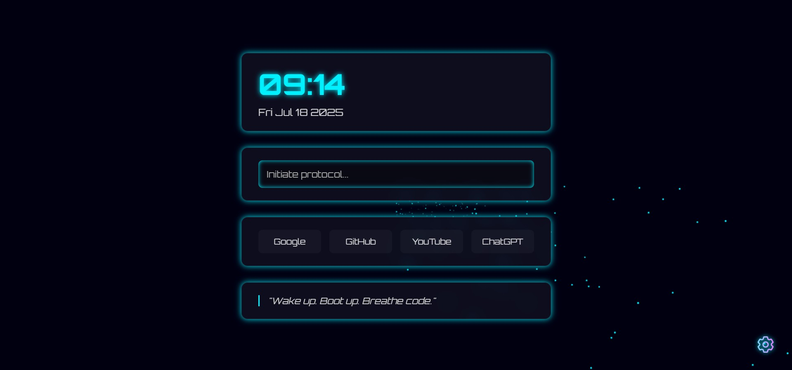
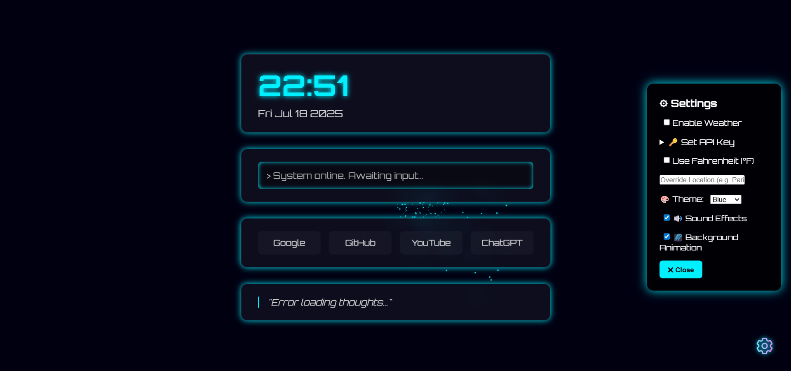

# ⚡ Futuristic Browser Homepage

A sleek, immersive, sci-fi inspired custom homepage built using only **HTML, CSS, and vanilla JavaScript** — no frameworks, no libraries. Features glowing widgets, customizable themes, dynamic background animation, and sound-reactive UI.

 <!-- Optional preview image 1-->
---
 <!-- Optional preview image 2-->

---

## 🔖 Version

**v1.0.0** — Initial Stable Release  
✨ Includes:
- Startup animation (smooth entrance)
- Real-time weather widget with API key, unit toggle, and location override
- Weather icons and error fallback
- Auto-refresh every 15 minutes
- Sound FX (hover, click, type, backspace)
- Live clock and date
- Theme switching (blue / green / red / purple)
- Background animation toggle (starscape)
- Sound toggle (hover, click, typing, backspace)
- Settings panel with localStorage support
- Clean glassmorphic + neon design
- Responsive layout foundation

---

## 🚀 Features

| Feature                 | Description                                      |
|------------------------|--------------------------------------------------|
| 🕒 Live Clock/Date      | Auto-updating widget                             |
| 🌦️ Weather Widget         | Real-time weather (API-based, with icons & location override) |
| 🔍 Terminal-style Search | Interactive styled input with typing sounds     |
| 📁 Quick Links Grid     | Easily edit your favorite destinations           |
| 💬 Quote of the Day     | Randomly selected from local JSON                |
| ⚙ Settings Panel        | Toggle sounds, animations, themes                |
| 🎨 Neon Theme System    | Fully dynamic via CSS variables                  |
| 🌌 Animated Background  | Starscape canvas                                 |
| 🔊 Sound FX             | Hover, click, type, backspace                    |
| 💾 Persistent Preferences | All settings saved via `localStorage`          |
| ⏳ Startup Animation      | Smooth fade-in UI loading animation            |

---

## 🧠 Tech Stack

- HTML5
- CSS3 (glassmorphism, variables, animations, keyframes. neon effects)
- Vanilla JavaScript (DOM, Canvas API, `localStorage`, Geolocation, Fetch)

No frameworks. No dependencies. No external libraries.

---

## 📁 Folder Structure

```

futuristic-homepage/
├── index.html
├── README.md
├── assets/
│   ├── css/
│   │   └── style.css
│   ├── js/
│   │   └── main.js
│   ├── fonts/
│   │   ├── Orbitron-VariableFont_wght.ttf
│   │   └── static/
│   │   ├── Orbitron-Regular.ttf
│   │   └── Orbitron-Bold.ttf
│   ├── sounds/
│   │   ├── hover.wav
│   │   ├── click.wav
│   │   ├── type.wav
│   │   └── backspace.wav
│   │   ├── type-ii.wav
│   │   └── backspace-ii.wav
│   ├── icons/
│   │ └── settings.svg
│   └── data/
│       └── quotes.json

````

---

## 🛠️ Customization

Feel free to tweak anything. Here's what you can easily edit:
- 🔗 Links grid (`index.html`)
- 💬 Quotes (`assets/data/quotes.json`)
- 🎧 Sounds (`assets/sounds/`)
- 🎨 Themes — Adjust color variables in CSS or expand theme options
- 🌦 **Weather** — Enable via settings panel

---

## 🌦 Weather Widget Usage

To use the weather widget:

1. Open the ⚙️ **Settings Panel**.
2. Enable `Weather` toggle.
3. Enter your **OpenWeather API Key** in the "Set API Key" section.
4. (Optional) Override location (e.g., `New York`).
5. Choose °C or °F via "Use Fahrenheit" toggle.

✅ Auto-refreshes every 15 minutes.  
❗ A warning icon (⚠️) appears if disabled, missing API key, or location fetch fails.

## 🌐 Live Preview

> Coming soon...

---

## 📦 Installation

1. Clone the repo:
```bash
git clone https://github.com/mavid3v/futuristic-homepage.git
````

2. Open `index.html` in your browser.

3. (Optional) Set it as your browser's homepage!
4. Enjoy your futuristic dashboard!

---

## 🧪 Planned Features (v1.2+)
- AI terminal assistant (voice/command)
- Sticky notes or to-do widgets
- Custom layout presets
- Animated welcome intro
- RSS feed module or news headlines
- Audio visualizer
- Music player integration

---

## 🧑‍💻 Author

Made with 💙 by Muawia Rehman

GitHub: [https://github.com/mavid3v](https://github.com/mavid3v)

---

## 📄 License

MIT License — use freely, modify fully, star generously 🚀

---
